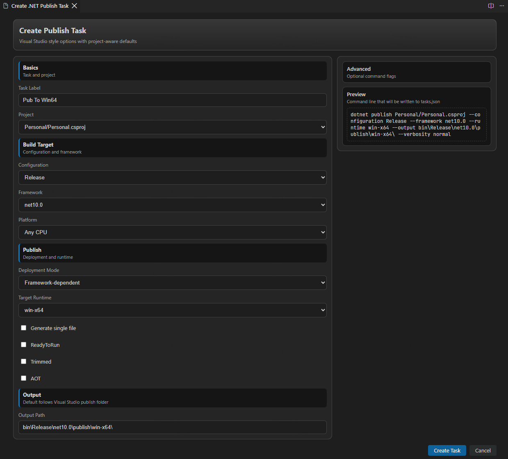
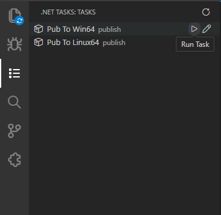

# .NET Tasks Kit

Generate and manage `dotnet build` / `dotnet publish` tasks in VS Code — without hand-editing `tasks.json`.

[](https://marketplace.visualstudio.com/items?itemName=XingbinChen.vscode-dotnet-tasks-kit)
[](https://marketplace.visualstudio.com/items?itemName=XingbinChen.vscode-dotnet-tasks-kit)

Stop memorizing `dotnet` CLI flags and fighting JSON commas. .NET Tasks Kit gives you a guided, project-aware form that writes valid VS Code tasks for you — plus a sidebar dashboard to run and edit them.



## Features

**Guided task creation**

- Build the full publish/build command from a form: configuration, framework, runtime identifier, output path, self-contained, single file, trimming, ReadyToRun, AOT, verbosity, and more
- Live preview shows the exact `dotnet` command before anything is written
- Deployment-mode rules enforced in the UI (e.g. self-contained requires a runtime, single-file requires self-contained)

**Project-aware defaults**

- Target frameworks, runtime identifiers, platforms, and configurations are read directly from your `.csproj` / `.fsproj` and `Directory.Build.props`
- Publish profiles (`Properties/PublishProfiles/*.pubxml`) prefill the form in one click
- Output paths follow standard .NET conventions (`bin/<Configuration>/<Framework>/publish/...`)

**Task dashboard in the Activity Bar**

- Every `dotnet publish` / `dotnet build` task from your workspace's `tasks.json`, one click away
- Inline **Run** and **Edit** actions on each task
- Refreshes automatically when `tasks.json` changes; multi-root workspaces supported



**Edit existing tasks — even hand-written ones**

- The same form opens pre-filled from the task's current arguments
- Only the managed fields (`label`, `args`, `options.cwd`) are updated: other tasks, comments, and custom fields stay untouched
- Arguments the form cannot represent (e.g. custom `-p:` MSBuild properties) are preserved verbatim and re-appended on save

**Safe `tasks.json` writes**

- Generated tasks are plain `shell` tasks invoking `dotnet` — they run on any machine, with or without this extension installed
- JSONC-aware editing preserves existing content and comments; a malformed `tasks.json` is reported, never overwritten

## Getting started

Create a task:

1. Right-click a `.csproj` / `.fsproj` file in the Explorer → `.NET Tasks` → `Create Publish Task` (or run the command from the Command Palette)
2. Pick your options in the form — the preview shows exactly what will be generated
3. Click `Create Task`; the task is appended to `.vscode/tasks.json`

Run or edit tasks:

1. Open the **.NET Tasks** container in the Activity Bar
2. Hover a task: use the play icon to run it, the pencil icon to edit it in the same form

## Commands

| Command | Description |
| --- | --- |
| `.NET Tasks: Create Publish Task` | Open the publish task form |
| `.NET Tasks: Create Build Task` | Open the build task form |

Both are also available from the Explorer context menu on `.csproj` / `.fsproj` files.

## Known limitations

- Editing regenerates a task's `args` from the form values; unrecognized arguments are kept but moved to the end of the argument list
- Tasks without a project argument, or with an `options.cwd` that cannot be resolved inside the workspace, cannot be edited in the form
- No delete workflow yet — delete tasks directly in `tasks.json`

## Requirements

- VS Code 1.85+
- .NET SDK (to run the generated tasks)

## Development

Prerequisites: Node.js 18+ and VS Code 1.85+.

```bash
npm install        # setup
npm run compile    # type-check + lint + bundle
npm test           # run tests in a VS Code Extension Host
```

Press `F5` in VS Code to launch an Extension Development Host. See `AGENTS.md` for architecture details.

## License

MIT
